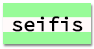

--- challenge ---

## Väljakutse: loo arvuti väljatrüki stiil

Loo vanamoodne arvuti väljatrüki stiil ja rakenda seda mõnele sõnale:

Sa vajad:

+ `VT323` fondiperekond lehelt <a href="http://jumpto.cc/web-fonts" target="_blank">jumpto.cc/web-fonts</a>. Kui sul on vaja meelde tuletada, kuidas kasutatakse Google'i fonte, vaata uuesti sammu 5.

+ `computer-printout-paper.png` taustapilt. Kui sul on vaja meelde tuletada, kuidas kasutatakse taustapilte, vaata uuesti sammu 4.

--- /challenge ---