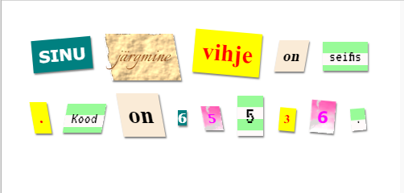

\--- väljakutse \---

## Väljakutse: loo oma stiilid

Nüüd looge oma klassi stiilid ja teeb oma salapärase kirja veelgi huvitavamaks. Kasutage eelmiste projektide käigus omandatud CSS-i ja vaadake ideid **näite stiilis .css** näiteid.

Siin on näide:

Näete pilte, mis on saadaval, klikkides prindipeade vahekaardil Pildid. Proovige seadistama pilditunde, kasutades ühte kaasatud pilti:

+ `rough-paper.png`

+ `canvas.png`

Kui teil on kinkekonto, saate oma pilte üles laadida, nagu te teatasite 'Telli lugu' projektist.

Leidke sobivaid fonte <a href="http://jumpto.cc/web-fonts" target="_blank">jumpto.cc/web-fonts</a> ja kopeerige oma `<link>` ja CSS-kood oma nippi, et neid kasutada.

\--- / väljakutse \---