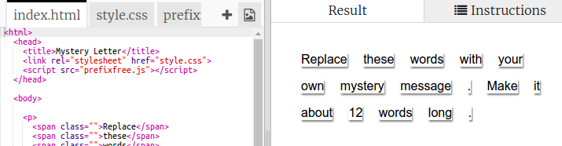

## ویرایش پیام شما

بیایید پیام خود را بر روی یک صفحه وب دریافت کنیم.

+ این نکته را باز کنید: <a href="http://jumpto.cc/web-letter" target="_blank">jumpto.cc/web-letter</a>.
    
    این پروژه باید چنین باشد:
    
    

+ برچسب پاراگراف `
` در پروژه تولدت مبارک معرفی شده است. برچسب `` برای گروه بندی قطعات کوچکتر متن در یک پاراگراف استفاده می شود تا بتوانیم آنها را سبک کنیم.

+ کلمات را به پیام خود تغییر دهید با قرار دادن یک کلمه در هر ``. اگر پیام شما دارای طول های متفاوت باشد، باید برچسب های `` را اضافه یا حذف کنید. 

+ بر روی دکمه Run کلیک کنید تا تست خود را انجام دهید.
    
    اگر به کلمات نگاه کنید، می توانید ببینید که آنها مدل شده اند تا به نظر برسد که روی صفحه قرار گرفته اند.