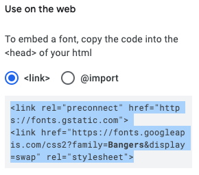

## یک کلاس جدید ایجاد کنید

بیایید یک سبک ایجاد کنیم که شبیه آن از کمیک است. <a href="http://jumpto.cc/web-fonts" target="_blank">jumpto.cc/web-fonts</a> بارهای فونت هایی را که برای استفاده رایگان هستند فراهم می کند.

+ یک کلاس `کمیک` در **file style.css** کنید. پس از `magazine2` محل خوبی است. نقطه را در مقابل نام کلاس فراموش نکنید 

نگران نباشید اگر هشدار دریافت کنید که «قانون خالی است»؛ شما بعدا برطرف میکنید

+ حالا برخی از CSS ها را به کلاس Comic CSS اضافه کنید. اگر دوست دارید، می توانید از رنگ های مختلف استفاده کنید. یک لیست از بارهای رنگ در <a href="http://jumpto.cc/colours" target="_blank">jumpto.cc/colors</a>.

+ استفاده از سبک کمیک در برخی از تگ های `` در سند HTML خود و تست صفحه خود:

+ حالا شما می توانید یک فونت سرگرم کننده اضافه کنید. یک برگه یا پنجره مرورگر جدید را باز کنید. برو به <a href="http://jumpto.cc/web-fonts" target="_blank">jumpto.cc/web-fonts</a> و جستجو برای **'bangers'**:

+ بر روی دکمه + "انتخاب این فونت" کلیک کنید:

پیامی که "1 خانواده انتخاب شده" در پایین صفحه ظاهر می شود.

+ روی پیغام "1 Family Selected" کلیک کنید تا پنجره باز شود و کدهای برجسته را کپی کنید:

+ کد `<link>` را وارد کنید که از فونت های Google به `<head>` صفحه وب خود کپی کرده اید:

این به شما اجازه می دهد تا از فونت Bangers در صفحه وب خود استفاده کنید.

+ بازگشت به فونت گوگل و پیمایش بیشتر در صفحه و کپی کد فونت-خانواده:

+ در حال حاضر به بازگشت به خود را **'را ببندید'** فایل در گول زنک و چسباندن کد فونت خانواده به سبک کمیک:

+ تست وب سایت خود را. نتیجه باید چیزی شبیه به این باشد: 

