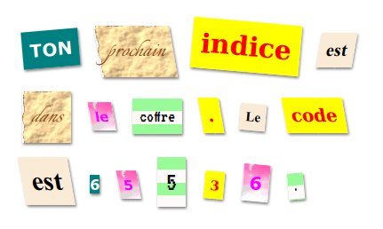

## Introduction

Dans ce projet, tu vas créer une lettre mystère dont chaque mot semble avoir été coupé dans un journal, un magazine, une bande dessinée ou une autre source.

### Informations complémentaires pour les responsables de club

Si vous avez besoin d'imprimer ce projet, voici la [version imprimable](https://projects.raspberrypi.org/en/projects/mystery-letter/print).

## \--- collapse \---

## title: Notes pour le responsable de club

## Introduction :

Dans ce projet, les enfants sont initiés aux classes CSS. Ils utiliseront plusieurs classes CSS pour styliser du texte et apprendront également à utiliser des images d'arrière-plan et des polices Google gratuites dans leurs projets.

## Ressources en-ligne

Nous vous recommandons d'utiliser [trinket](https://trinket.io/) pour écrire les codes HTML & CSS en ligne. Ce projet contient le Trinket suivant:

* [Point de départ de "Lettre mystère" - jumpto.cc/web-letter](http://jumpto.cc/web-letter)

Les enfants peuvent également utiliser ce Trinket vide [(jumpto.cc/html-blank)](http://jumpto.cc/html-blank) pour écrire leur propre code HTML & CSS, ou utiliser ce Trinket modèle [(jumpto.cc/html-template)](http://jumpto.cc/html-template).

Il y a aussi un Trinket contenant un exemple de solution pour les défis :

* ["Lettre mystère terminée" - trinket.io/html/1d4d4c5ce1](https://trinket.io/html/1d4d4c5ce1)

## Ressources hors-ligne

Ce projet peut être [réalisé hors-ligne](https://www.codeclubprojects.org/en-GB/resources/webdev-working-offline/). Vous pouvez accéder aux ressources du projet en cliquant sur le lien "Matériel pour projet". Ce lien contient une section "Ressources du projet" qui inclut les ressources dont les enfants auront besoin pour compléter le projet hors-ligne. Assurez-vous que les enfants ont un accès à une copie de ces ressources. Cette section inclut les fichiers suivants :

* mystery-letter/index.html
* mystery-letter/style.css
* mystery-letter/script.js
* mystery-letter/prefixfree.js
* lettre mystère/4 x images .png
* template/template.html
* template/style.css

Vous pouvez aussi trouver une version terminée du projet dans la section "Ressources du bénévole" qui contient :

* mystery-letter-finish/index.html
* mystery-letter-finish/style.css
* mystère-lettre-fini/script.js
* mystery-letter-finish/prefixfree.js
* mystery-letter-finished/4 x images .png

(Toutes les ressources ci-dessus peuvent aussi être téléchargées dans l'archive `.zip`)

## Objectifs d'apprentissage

* Ce projet présente les classes CSS et la possibilité de styliser des éléments HTML avec plusieurs classes.
* Des images d'arrière-plan et des polices Google sont également introduites. 

Ce projet couvre les éléments suivants du [Programme Raspberry Pi de Créativité Numérique](http://rpf.io/curriculum) :

* [Concevoir des éléments de base en 2D et 3D](https://www.raspberrypi.org/curriculum/design/creator).

## Défis

* “Personnalise ton message” - Appliquez les styles de classe CSS fournis;
* “Créer un style Écran d'ordinateur” - Utilisez CSS pour recréer un exemple de classe à l'aide d'une image d'arrière-plan et d'une police Google. 
* “Créer ton propre style” - Utilisez CSS pour créer de nouveaux styles.

\--- /collapse \---

## \--- collapse \---

## title: Matériel pour le projet

## Ressources pour le projet

* [Fichier .zip contenant toutes les ressources du projet](resources/letter-project-resources.zip)
* [Trinket contenant toutes les ressources du projet 'Lettre mystère'](http://jumpto.cc/web-letter)
* [Modèle de Trinket en ligne](http://jumpto.cc/trinket-template)
* [Trinket vierge](http://jumpto.cc/trinket-blank)
* [template/index.html](resources/template-index.html)
* [template/style.css](resources/template-style.css)
* [mystery-letter/index.html](resources/mystery-letter-index.html)
* [mystery-letter/style.css](resources/mystery-letter-style.css)
* [mystery-letter/prefixfree.js](resources/mystery-letter-prefixfree.js)
* [mystery-letter/rough-paper.png](resources/mystery-letter-rough-paper.png)
* [mystery-letter/canvas.png](resources/mystery-letter-canvas.png)
* [mystery-letter/pink-pattern.png](resources/mystery-letter-pink-pattern.png)
* [mystery-letter/ordinateur-printout-paper.png](resources/mystery-letter-computer-printout-paper.png)

## Ressources pour le responsable de club

* [Fichier .zip contenant toutes les ressources du projet terminé](resources/letter-volunteer-resources.zip)
* [Projet Trinket en ligne terminé](https://trinket.io/html/1d4d4c5ce1)
* [mystery-letter-finish/index.html](resources/mystery-letter-finished-index.html)
* [mystery-letter-finish/style.css](resources/mystery-letter-finished-style.css)
* [mystery-letter-finish/prefixfree.js](resources/mystery-letter-finished-prefixfree.js)
* [mystery-letter-finish/rough-paper.png](resources/mystery-letter-finished-rough-paper.png)
* [mystery-letter-finish/canvas.png](resources/mystery-letter-finished-canvas.png)
* [mystery-letter-finish/pink-pattern.png](resources/mystery-letter-finished-pink-pattern.png)
* [mystery-letter-finished/ordinateur-printout-paper.png](resources/mystery-letter-finished-computer-printout-paper.png)

\--- /collapse \---