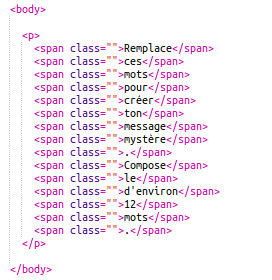
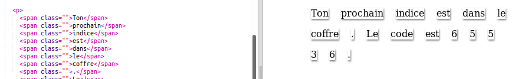

## Édite ton message

C'est parti, écrit ton message dans ta page web.

+ Ouvre ce trinket: <a href="http://jumpto.cc/web-letter" target="_blank">jumpto.cc/web-letter</a>. Si tu lis ce projet en ligne, tu peux aussi utiliser la version embarquée de ce trinket ci-dessous.

  <iframe src="https://trinket.io/embed/html/b5fbcf112e" width="100%" height="400" frameborder="0" marginwidth="0" marginheight="0" allowfullscreen>
  </iframe>

+ l'Élément paragraphe `
` a été introduit dans le projet 'Joyeux Anniversaire'. l'Élement `` peut être utiliser pour rassembler plusieurs élément de texte a l'intérieur d'un paragraphe pour qu'on puisse le stylé.

+ Change les mots de ton message en ajoutant un mot par element ``. Tu devras ajouter ou enlever des élements `` si ton message a une longueur différente.

+ Appuie sur le bouton 'Run' pour tester ton trinket.

	Si tu regardes les mots de plus pres, tu peux voir que les mots on été stylé et qu'on dirais qu'ils sont collés a la page.

