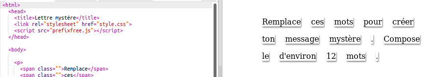

## Édite ton message

Écris ton message sur une page Web.

+ Ouvre ce trinket : <a href="https://trinket.io/html/e5b21da92b" target="_blank">trinket.io/html/e5b21da92b</a>.
    
    Le projet devrait ressembler à ceci :
    
    

+ La balise paragraphe `
` est introduite dans le projet "Joyeux anniversaire". La balise `` sert à regrouper des morceaux de texte plus petits dans un paragraphe afin que nous puissions les styler.

+ Modifie les mots de ton message en mettant un mot dans chaque ``. Tu peux ajouter ou supprimer des balises `` si la longueur de ton message est différente. 

+ Clique sur le bouton Exécuter pour tester ton code.
    
    Si tu regardes les mots, tu peux voir qu'ils ont été stylés pour donner l'impression qu'ils ont été collés sur la page.