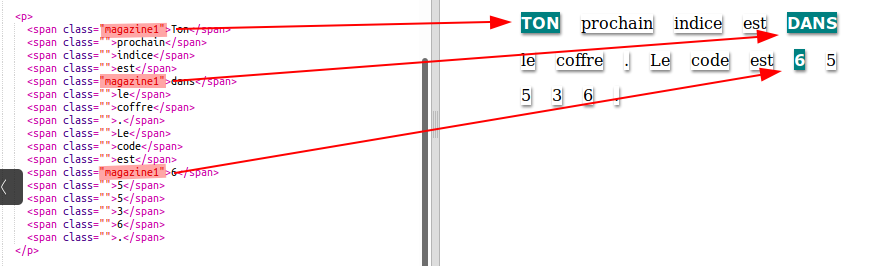
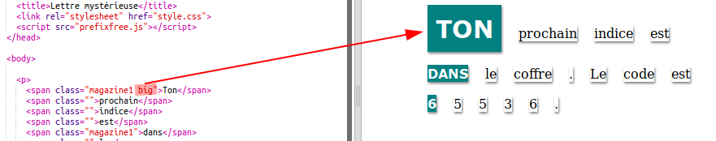

## Utilisation des classes CSS

+ As-tu remarqué le `class = ""` dans les balises `` ? Tu peux l'utiliser pour personnaliser plus d'une chose de la même manière.

+ Ajoute la classe `magazine1` à quelques-unes de tes balises `` et teste ta page Web.

+ Tu peux ajouter plus d'une classe à un élément. Laisse juste un espace entre les deux. Ajoute la classe `big` à l’un de tes balises ``. Teste ta page. 

