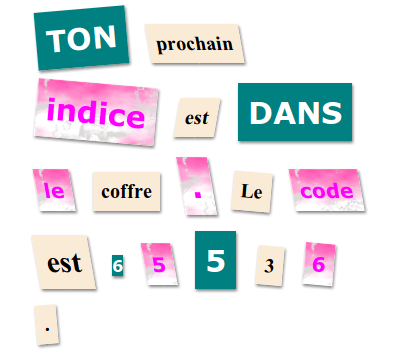

--- challenge ---
## Défi: Style ton message

Utilise les styles deja présent pour tourner ton message en lettre mystère.

Ajoute ces classes à tes élements ``:

+ `newspaper`, `magazine1`, `magazine2`

+ `medium`, `big`, `reallybig`

+ `rotateleft`, `rotateright`

+ `skewleft`, `skewright`

N'ajoute pas plus d'une classe par ligne à un élément `` en particulier.

Voici à quoi ta lettre devrais ressembler:

--- /challenge ---