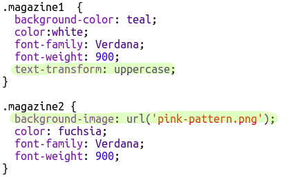

## Édite tes classes

+ Clique sur l'onglet __'style.css'__. Trouve le style pour la classe `newspaper` que tu viens d'utiliser.

+ Remarque qu'il y a un point '.' avant chaque nom de tes classes dans ton fichier CSS mais pas sur tes éléments `` dans ton document HTML.

+ Maintenant regarde les autres classes CSS que tu as utiliser pour stylé ta lettre mystère. Peut tu trouver:

	+ Comment la classe `magazine1` change le texte en le rendant tout en majuscules.

	+ Comment la classe `magazine2` ajoute une image derrière le texte.

+ Que se passe-t-il si tu change la propriété `background-image` de la classe `magazine2` en `canvas.png`? Si tu préferes l'image `pink-pattern.png` tu peux toujours la remettre.

Tu peux aussi changer les couleurs dans tes styles de magazine si tu veux.

+ Trouve le code CSS utilisé pour tourner (`rotate` en anglais) ou incliner (`skew` en anglais) tes mots:

Essaye de changer les nombres pour créer differents effets et ensuite les tester sur ta page.

