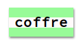

\--- challenge \---

## Challenge

\--- task \---

Create an old-fashioned computer printout style and apply it to some of the words:

Use the `VT323` font family from <http://jumpto.cc/web-fonts>{:target="_blank"} and the `computer-paper.png` background image.

\--- /task \---

\--- task \---

Create another new class with your own style, and apply it to some of the words in your message. We have included two other image backgrounds for you to use if you want to:

+ `rough-paper.png`
+ `canvas.png`

\--- /task \---

\--- /challenge \---