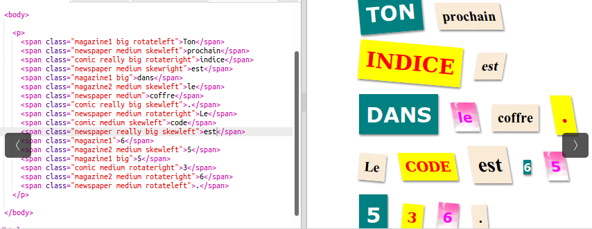
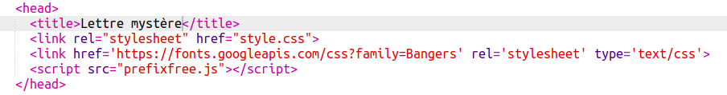
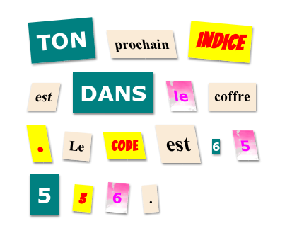

## Créer une nouvelle classe

Créons un style qui a l'air d'avoir été découpé à partir d'une bande dessinée. <a href="http://jumpto.cc/web-fonts" target="_blank">jumpto.cc/web-fonts</a> fournit des polices de caractères libres d'utilisation.

+ Ajoute la classe `comic` dans le fichier **style.css**. Après `magazine2` par exemple. N'oublie pas le point devant le nom de la classe. 

Ne t’inquiète pas si tu reçois un avertissement disant que « la règle est vide » (« The Rule is empty »); Cela va être corrigé.

+ Ajoute maintenant du CSS à la classe CSS « comic ». Tu peux utiliser différentes couleurs si tu le souhaites. Il y a une liste de couleurs à <a href="http://jumpto.cc/colours" target="_blank">jumpto.cc/colours</a>.

+ Utilise ce nouveau style dans quelques balises `` de ton document HTML et teste ta page :

+ Maintenant, tu peux ajouter une police de caractères amusante. Ouvre un nouvel onglet ou une nouvelle fenêtre de ton navigateur. Va sur <a href="http://jumpto.cc/web-fonts" target="_blank">jumpto.cc/web-fonts</a> et recherche **« bangers »** :

+ Clique sur le bouton « Select this font » :

Un message disant « 1 Family Selected » apparaîtra en bas de l'écran.

+ Clique sur le message « 1 Family Selected » pour ouvrir la fenêtre et copie le code en surbrillance :

+ Colle le code `<link>` que tu viens de copier des polices Google dans le `<head>` de ta page Web :

Cela te permet d'utiliser la police Bangers dans ta page Web.

+ Retourne aux polices de caractères Google, fais défiler la page et copie le code « font-family » :

+ Maintenant, retourne à ton fichier **« style.css »** dans Trinket et colle le code « font-family » dans le style « comic » :

+ Teste ta page Web. Le résultat devrait ressembler à ceci : 

