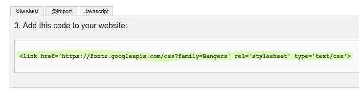

## Créer une nouvelle classe

On va maintenant créer un nouveau style qui ressemble à une page de bande-dessinnée. <a href="http://jumpto.cc/web-fonts" target="_blank">jumpto.cc/web-fonts</a> te donneras plein d'exemples que tu peux utiliser gratuitement.

+ Ajoute la classe `comic` dans ton fichier __style.css__. A la suite de `magazine2` est une bonne idée. N'oublie pas le point au debut de ta classe.

Ne t'inquiètes pas si tu vois une erreur comme 'The Rule is empty' (la règle est vide), on va fixer cela plutard.

+ Maintenant, ajouter plus de CSS à ta nouvelle classe. Tu peux utiliser différentes couleurs si tu veux. Il y a plein de couleurs derrière ce lien <a href="http://jumpto.cc/web-colours" target="_blank">jumpto.cc/web-colours</a>

+ Utilise les styles de la classe comic sur quelques éléments `` dans ton document HTML et teste ta page:

+ Maintenant tu peux ajouter une police un peu plus rigolote. Ouvre un nouvel onglet dans ton navigateur. Va sur la page <a href="http://jumpto.cc/web-fonts" target="_blank">jumpto.cc/web-fonts</a> et recherche le mot __'bangers'__:

+ Clique sur le bouton 'Quick-use' (demande l'aide de ton professeur si tu as besoin):

+ Une nouvelle page va se charger. Fait défiler ta page jusqu'a ce que tu vois:

Et copie le texte souligné.

+ Copie le code `<link>` que tu viens de copier depuis Google fonts dans ton élément `<head>` de ta page.

Ceci va te permettre d'utiliser la police Bangers dans ta page.

+ Retourne sur ta page Google fonts et fait défiler ta liste encore plus et copie le code `font-family`:

+ Maintenant, retourne sur ton fichier __'style.css'__ dans trinket et colle le code `font-family` dans ta classe comic:

+ Test ta page web. Le resultat devrais ressembler à ceci:

