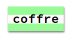

--- challenge ---
## Défi:  Créer un style écran d'ordinateur

Créer un style écran d'ordinateur à l'ancienne et applique ce style sur quelques-uns de tes mots:

Tu auras besoin de :

+ La police `VT323` que tu peux trouver ici <a href="http://jumpto.cc/web-fonts" target="_blank">jumpto.cc/web-fonts</a>. Retourne à l'étape 5 si tu as besoin de revoir comment ajouter une police Google.

+ De l'image de fond `computer-printout-paper.png`. Retourne à l'étape 4 si tu as besoin de revoir comment utiliser les images de fonds.

--- /challenge ---