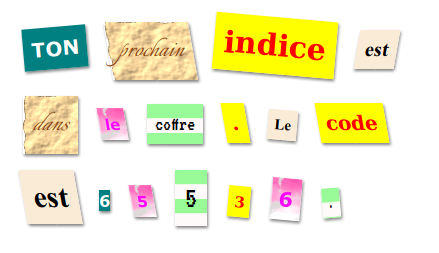

--- challenge ---
## Défi: Créer ton prore style

Maintenant crée ta propre classes et rend ta lettre mystère encore plus mysterieuse. Utilise le CSS que tu as appris dans tes projets précédents et regarde les exemples dans ton fichier __style.css__ pour avoir plus d'idées.

Voila un exemple:

Tu peux voir les images qui sont disponible en cliquant sur l'onglet Images dans trinket.
Essaie de mettre une image de fond en utilisant une de ces images:

+ `rough-paper.png`

+ `canvas.png`

Si tu as un compte trinket, tu peux télécharger des images de ton ordinateur comme tu l'as fait dans le projet 'Raconte une histoire'.

Cherche une police que tu aimes sur la page on <a href="http://jumpto.cc/web-fonts" target="_blank">jumpto.cc/web-fonts</a> et copie le lien `<link>` et ajoute le code CSS a ton trinket pour les utiliser.

--- /challenge ---