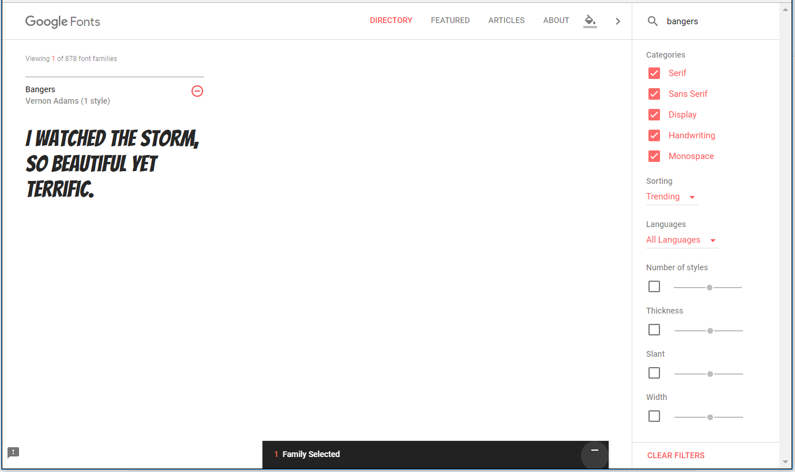

## एक नया क्लास बनाएँ

आइए एक स्टाइल बनाएं जो ऐसी दिखती है जैसे इसे कॉमिक से काटा गया है। <a href="http://jumpto.cc/web-fonts" target="_blank">jumpto.cc/web-fonts</a> ढेर सारे फोंट प्रदान करता है जो उपयोग करने के लिए नि: शुल्क हैं।

+ **style.css** फ़ाइल में एक `कॉमिक` क्लास जोड़ें। `magazine2` के बाद एक अच्छी जगह है। क्लास​ के नाम के सामने वाले बिंदु को न भूलें। 

अगर आपको यह कहते हुए चेतावनी मिलती है कि 'The Rule is empty' तो चिंता न करें; आप इसे आगे ठीक कर देंगे।

+ अब comic CSS क्लास​ में कुछ CSS जोड़ें। आप चाहें तो अलग-अलग रंगों का इस्तेमाल कर सकते हैं। आप <a href="http://jumpto.cc/colours" target="_blank">jumpto.cc/colours</a> पर अधिक रंगो के नाम पा सकते हैं ।

+ अपने HTML डॉक्यूमेंट में कुछ `` टैग में comic स्टाइल का उपयोग करें और अपने पृष्ठ का परीक्षण करें:

+ अब आप एक मजेदार फ़ॉन्ट जोड़ सकते हैं। एक नया ब्राउज़र टैब या विंडो खोलें। <a href="http://jumpto.cc/web-fonts" target="_blank">jumpto.cc/web-fonts</a> पर जाएं और **'bangers'** की खोज करें:

+ Click on the font preview box then click on '+ Select this style':

View your selected fonts by clicking on the 'View your selected families' icon in the top right menu bar:

+ Go to the 'Use on the web' section, copy the text from the <link />
    box:

+ अपने वेब पृष्ठ के `<head>` में वह `<link>` कोड पेस्ट करें जिसे आपने अभी-अभी Google फोंट से कॉपी किया है:

इससे आप अपने वेब पृष्ठ में Bangers फ़ॉन्ट का उपयोग कर सकते हैं।

+ Return to Google fonts and scroll further down to copy the CSS font-family code:

+ अब trinket में अपने **'style.css'** फ़ाइल पर वापस जाएं और font-family कोड को comic स्टाइल में पेस्ट करें:

+ अपने वेब पृष्ठ का परीक्षण करें। परिणाम कुछ इस तरह दिखना चाहिए: 

