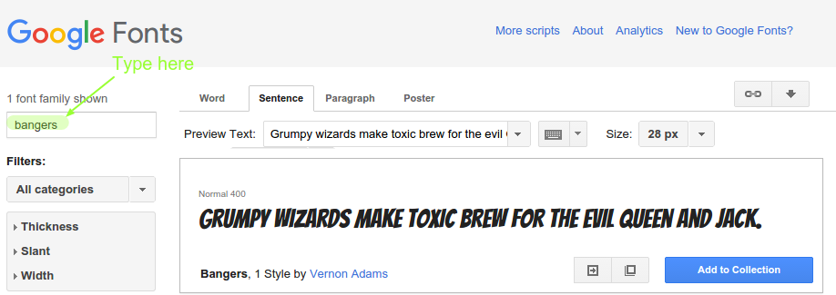

## नई क्लास बनाएँ 

चलिए स्टाइल बनाएँ जो कि ऐसा दिखाई देता हो कि कॉमिक से काटा हो। <a href="http://jumpto.cc/web-fonts" target="_blank">jumpto.cc/web-fonts</a> ऐसे कई फॉन्ट प्रदान करता है जो उपयोग के लिए निशुल्क उपलब्ध होते हैं। 

+ __style.css__ फाइल में `comic` क्लास जोड़ें। `magazine2` का अच्छा स्थान होने पर। क्लास के नाम का आगे का डॉट न भूलें। 

'The Rule is empty' के चेतावनी संकेत की स्थिति में चिंता न करें; आप इसके बाद इसे ठीक कर लेंगे।

+ अब CSS कॉमिक क्लास में कुछ CSS जोड़ें। यदि आप चाहें तो भिन्न-भिन्न रंगों का उपयोग कर सकते हैं। <a href="http://jumpto.cc/colours" target="_blank">jumpto.cc/colours</a> में कई रंगों की सूची है।

+ आपके HTML डॉक्यूमेंट में कुछ `` में कॉमिक स्टाइल का उपयोग करें और अपने पेज का परीक्षण करें:

+ अब आप मज़ेदार फॉन्ट जोड़ सकते हैं। नई ब्राउज़र टैब या विंडो खोलें। <a href="http://jumpto.cc/web-fonts" target="_blank">jumpto.cc/web-fonts</a> पर जाएँ और __'bangers'__खोजें:

+ Quick-use बटन पर क्लिक करें:

+ नया पेज लोड होगा तब तक नीचे स्कॉल करें जब तक आपको यह न दिखाई दे:

और हाइलाइट किया गया कोड को कॉपी करें। 

+ गूगल फॉन्ट से कॉपी किए `<link>` कोड को अपने वेबपेज के `<head>` में पेस्ट करें:

यह आपको आपके वेबपेज में Bangers फॉन्ट का उपयोग करने की सुविधा प्रदान करता है। 

+ गूगल फॉन्ट पर वापस जाएँ और पेज के नीचे स्कॉल करें और फॉन्ट-फॅमिली कोड को कॉपी करें:

+ अब ट्रिंकेट में अपनी__'style.css'__ फाइल में वापस जाएँ और कॉमिक स्टाइल में फॉन्ट-फॅमिली कोड को पेस्ट करें:

+ अपने वेबपेज का परीक्षण करें। परिणाम कुछ इस प्रकार दिखाई देना चाहिए: 

