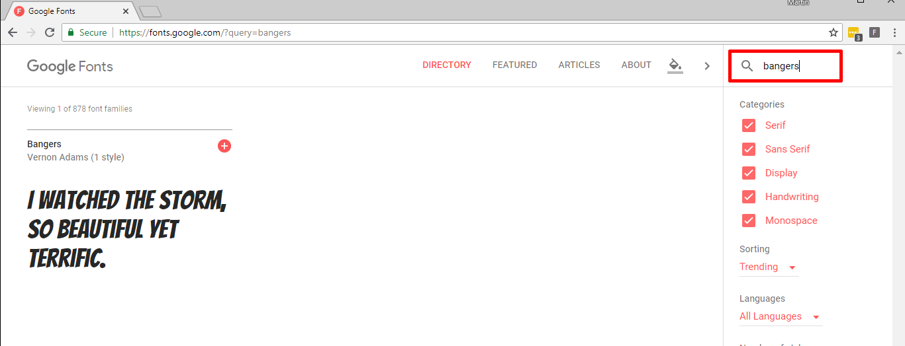

## नई क्लास बनाएँ

आइए एक स्टाइल बनाएं जो ऐसा दिखता है जैसे इसे कॉमिक से काट दिया गया है। <a href="http://jumpto.cc/web-fonts" target="_blank">jumpto.cc/web-fonts</a> ढेर सारे फोंट प्रदान करता है जो उपयोग करने के लिए स्वतंत्र हैं।

+ एक `comic` क्लास​ जोड़ें **style.css** फ़ाइल मे। `magazine2` के बाद एक अच्छी जगह है। क्लास​ के नाम के सामने डॉट मत भुलियेगा। 

चिंता न करें अगर आपको यह कहते हुए चेतावनी मिलती है कि 'The Rule is empty'; अग्ले मे आप इसे ठीक कर देंगे।

+ अब कॉमिक क्लास​ में कुछ CSS जोड़ें। आप चाहें तो अलग-अलग रंगों का इस्तेमाल कर सकते हैं। आप <a href="http://jumpto.cc/colours" target="_blank">jumpto.cc/colours</a> पर अधिक रंगो के नाम पा सकते हैं ।

+ अपने HTML डॉक्यूमेंट में कुछ `` टैग में कॉमिक स्टाइल का उपयोग करें और अपने पृष्ठ का परीक्षण करें:

+ अब आप एक मजेदार फ़ॉन्ट जोड़ सकते हैं। एक नया ब्राउज़र टैब या विंडो खोलें। <a href="http://jumpto.cc/web-fonts" target="_blank">jumpto.cc/web-fonts</a> पर जाएं और **'bangers'** की खोज करें:

+ + "Select this font" बटन पर क्लिक करें:

एक संदेश "1 Family Selected" स्क्रीन पर सबसे नीचे दिखाई देगा।

+ विंडो खोलने और हाइलाइट किए गए कोड को कॉपी करने के लिए "1 Family Selected" संदेश पर क्लिक करें:

+ `<link>` कोड पेस्ट करें जिसे आपने Google फोंट से अपने वेबपेज के `<head>` में कॉपी किया है:

इससे आप अपने वेब पृष्ठ में Bangers फ़ॉन्ट का उपयोग कर सकते हैं।

+ Google फ़ॉन्ट पर लौटें और पृष्ठ को और नीचे स्क्रॉल करें और font-family कोड कॉपी करें:

+ अब trinket में अपने **'style.css'** फ़ाइल पर वापस जाएं और font-family कोड को कॉमिक स्टाइल में पेस्ट करें:

+ अपनी पृष्ठी का परीक्षण करें। परिणाम कुछ इस तरह दिखना चाहिए: 

