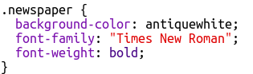

## Osztályok szerkesztése

+ Kattintson a **'style.css'** fülre. Keresse meg a használt `újság` CSS osztály stílusát.

+ Vegye figyelembe, hogy van egy pont (pont). az osztály neve előtt a CSS fájlban, de nem a HTML dokumentum `` címkéjében.

+ Most nézd meg azokat a többi CSS osztályt, amelyekkel rejtélyes levelet írtál. Meg tudod találni:
    
    + Hogy a `magazine1` stílus megváltozik a szöveg nagybetűs (tőke) betűkkel.
    
    + Hogyan helyezi el a képet a `magazin2` stílusa?

+ Mi történik, ha megváltoztatja a `background-image` a `magazine2` , hogy `canvas.png`? Ha inkább a `pink-pattern.png` képet szeretné, megváltoztathatja. 

Megváltoztathatja a magazin stílusainak színeit is, ha úgy tetszik.

+ Keresse meg a szavak elforgatásához és elfordításához (döntéséhez) használt CSS-t:

Próbálja meg megváltoztatni a számokat, hogy különféle effektusokat hozzon létre, majd tesztelje az oldalt.