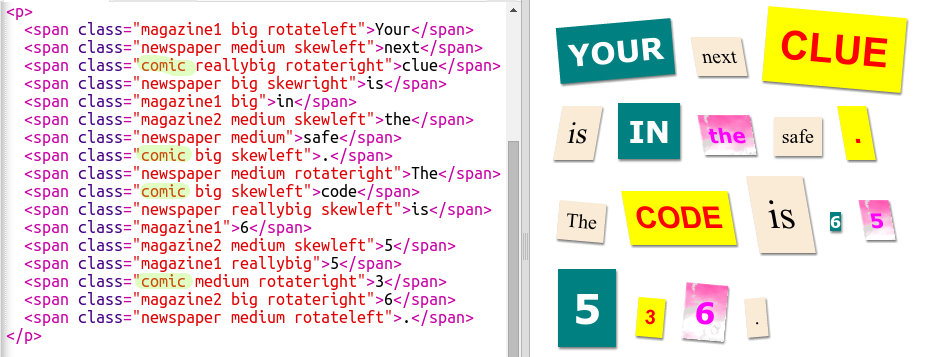

## Hozzon létre egy új osztályt

Készítsünk olyan stílust, amely úgy néz ki, mintha egy képregényből lett volna kivágva. <a href="http://jumpto.cc/web-fonts" target="_blank">jumpto.cc/web-fonts</a> rengeteg szabadon használható betűtípust biztosít.

+ Adjon hozzá `képregény` osztályt a **style.css** fájlhoz. `után magazin2` jó hely. Ne felejtsd el az osztálynév előtti pontot. 

Ne aggódjon, ha figyelmeztetést kap, amely azt mondja: „A szabály üres”; ezt megjavíthatod.

+ Most adjunk hozzá néhány CSS-t a képregény CSS-osztályhoz. Különböző színeket is használhat, ha úgy tetszik. A színkódok listája a <a href="http://jumpto.cc/colours" target="_blank">jumpto.cc/colours</a>címen található.

+ Használja a képregény stílust a HTML-dokumentumban szereplő `` címkék valamelyikében, és tesztelje az oldalt:

+ Most hozzáadhat egy szórakoztató betűtípust. Nyisson meg egy új böngésző lapot vagy ablakot. Ugrás a <a href="http://jumpto.cc/web-fonts" target="_blank">jumpto.cc/web-fonts</a> oldalra és keressen a **'bangers'**elemre:

+ Kattintson a + "Válassza ezt a betűtípust" gombra:

A képernyő alján megjelenik egy "1 család kiválasztva" üzenet.

+ Kattintson az "1 család kiválasztott" üzenetre az ablak megnyitásához és a kiemelt kód másolásához:

+ Illessze be a `<link>` kódot, amelyet éppen lemásolt a Google betűkészletből, a weboldal `<head>`:

Ez lehetővé teszi a Bangers betűkészlet használatát a weboldalán.

+ Vissza a Google betűtípusokhoz, görgessen tovább az oldalon, és másolja a betűkészlet-család kódját:

+ Most térjen vissza a **'style.css'** fájlhoz az csecsebecsében, és illessze be a betűtípus-család kódját a képregény stílusba:

+ Tesztelje weboldalát. Az eredménynek így kell kinéznie: 

