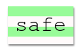

\--- kihívás \---

## Kihívás: hozzon létre egy számítógépes nyomtatási stílust

Hozzon létre egy régimódi számítógépes nyomtatási stílust, és alkalmazza azt néhány szóra:

Szükséged lesz:

+ A `VT323` betűtípus-család a <a href="http://jumpto.cc/web-fonts" target="_blank">jumpto.cc/web-fonts</a>. Visszatekint az 5. lépésre, ha emlékeztetőre van szüksége a Google betűkészletek használatáról.

+ A `számítógép-nyomtatás-paper.png` háttérkép. Visszatekintve a 4. lépésre, ha emlékeztetőre van szüksége a háttérképek használatáról.

\--- / challenge \---