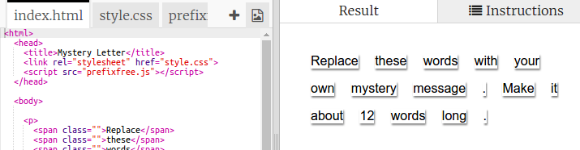

## Mengedit Pesan Anda

Mari pesan Anda ke halaman web.

+ Buka trinket ini: <a href="http://jumpto.cc/web-letter" target="_blank">jumpto.cc/web-letter</a>.
    
    Proyek akan terlihat seperti ini:
    
    

+ Tag `
` paragraf diperkenalkan dalam proyek 'Selamat Ulang Tahun'. Tag `` digunakan untuk mengelompokkan potongan-potongan teks yang lebih kecil di dalam paragraf sehingga kita dapat mengaturnya.

+ Ubah kata-kata ke pesan Anda dengan menempatkan satu kata di setiap ``. Anda perlu menambahkan atau menghapus tag `` jika panjang pesan Anda berbeda. 

+ Klik tombol Run untuk menguji trinket Anda.
    
    Jika Anda melihat kata-kata, Anda dapat melihat bahwa mereka telah ditata untuk terlihat seperti mereka terjebak di halaman.