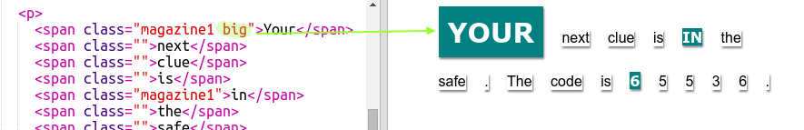

## Menggunakan Gaya Kelas

+ Apakah Anda memperhatikan `class = ""` dalam tag ``? Anda dapat menggunakan ini untuk menata lebih dari satu hal dengan cara yang sama.

+ Tambahkan kelas `magazine1` ke beberapa tag `` dan uji halaman web Anda.

+ Anda dapat menambahkan lebih dari satu kelas ke elemen. Sisakan ruang di antaranya. Tambahkan kelas `besar` ke salah satu dari tag ``. Uji halaman Anda. 

