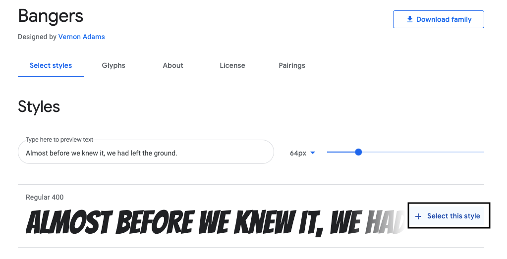
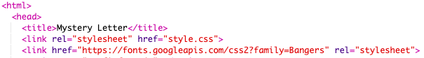

## Buat Kelas Baru

Mari buat gaya yang terlihat seperti dipotong dari Komik. <a href="http://jumpto.cc/web-fonts" target="_blank">jumpto.cc/web-fonts</a> menyediakan banyak font yang gratis untuk digunakan.

+ Tambahkan kelas `komik` dalam **file style.css**. Setelah `magazine2` adalah tempat yang bagus. Jangan lupa titik di depan nama kelas. 

Jangan khawatir jika Anda mendapat peringatan yang mengatakan bahwa 'Aturan itu kosong'; Anda akan memperbaikinya selanjutnya.

+ Sekarang tambahkan beberapa CSS ke kelas CSS komik. Anda dapat menggunakan warna yang berbeda jika Anda suka. Ada daftar banyak warna pada <a href="http://jumpto.cc/colours" target="_blank">jumpto.cc/colours</a>.

+ Gunakan gaya komik di beberapa tag `` di dokumen HTML Anda dan uji halaman Anda:

+ Sekarang Anda dapat menambahkan font yang menyenangkan. Buka tab atau jendela browser baru. Pergi ke <a href="http://jumpto.cc/web-fonts" target="_blank">jumpto.cc/web-fonts</a> dan cari **'bangers'**:

+ Klik tombol + "Pilih font ini":

Pesan yang mengatakan "1 Keluarga Dipilih" akan muncul di bagian bawah layar.

+ Klik pada pesan "1 Family Selected" untuk membuka jendela dan menyalin kode yang disorot:

+ Tempel kode `<link>` yang baru saja Anda salin dari Google font ke `<head>` halaman web Anda:

Ini memungkinkan Anda untuk menggunakan font Bangers di halaman web Anda.

+ Kembali ke Google font dan gulirkan lebih jauh ke bawah halaman dan salin kode font-family:

+ Sekarang kembali ke file **'style.css' Anda** di trinket dan tempel kode font-family ke dalam gaya komik:

+ Uji halaman web Anda. Hasilnya akan terlihat seperti ini: 

