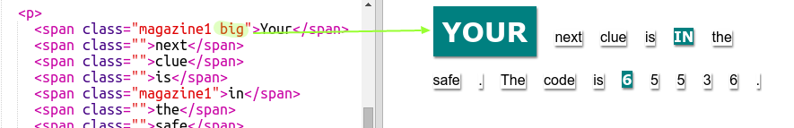

## Utilizzo degli stili di classe

+ Hai notato la dicitura `class=""` nei tag ``? Puoi utilizzare questa proprietà per attribuire uno stile a più elementi nello stesso modo.

+ Aggiungi la classe `magazine1` ad alcuni dei tag `` e verifica la pagina Web.

+ È possibile aggiungere più di una classe a un elemento. Basterà lasciare uno spazio al centro. Aggiungi la classe `big` a uno dei tag ``. Verifica la pagina.

