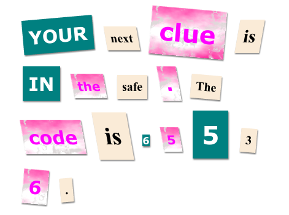

--- challenge ---
## Sfida: Attribuisci uno stile al messaggio

Utilizza gli stili forniti in modo che il messaggio sembri una lettera misteriosa.

Aggiungi queste classi ai tag ``:

+ `newspaper`, `magazine1`, `magazine2`

+ `medium`, `big`, `reallybig`

+ `rotateleft`, `rotateright`

+ `skewleft`, `skewright`

Per ogni ``, scegli solamente una delle classi per riga.

Ecco come potrebbe apparire la tua lettera:

--- /challenge ---