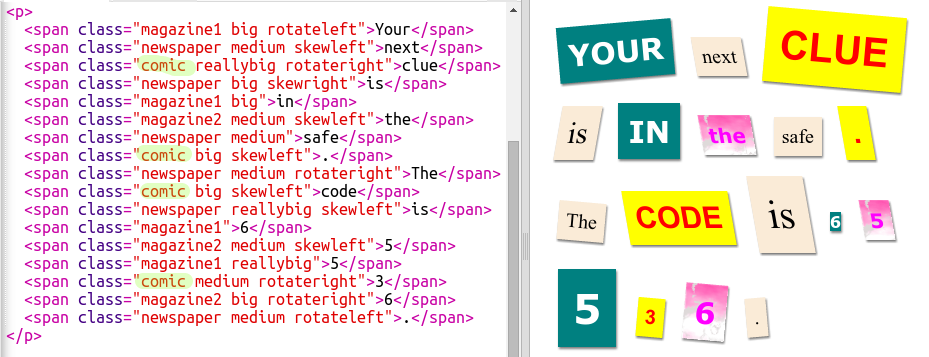
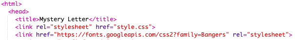
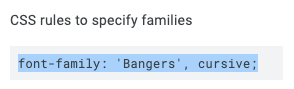

## Creazione di una nuova classe

Creiamo uno stile che sembri essere stato ritagliato da un fumetto. <a href="http://jumpto.cc/web-fonts" target="_blank">jumpto.cc/web-fonts</a> offre moltissimi caratteri che possono essere utilizzati gratuitamente.

+ Aggiungi la classe `comic` nel file __style.css__. La posizione ideale sarebbe dopo `magazine2`. Non dimenticare il punto davanti al nome della classe.

Non ti preoccupare se appare la scritta "The Rule is empty" (La regola è vuota); risolverai dopo il problema.

+ Ora aggiungi codice CSS alla classe CSS comic. Se vuoi, puoi utilizzare diversi colori. C’è un elenco con moltissimi colori su <a href="http://jumpto.cc/colours" target="_blank">jumpto.cc/colours</a>.

+ Utilizza lo stile comic per alcuni dei tag `` del documento HTML e verifica la pagina:

+ Aggiungi adesso un carattere divertente. Apri una nuova finestra o scheda del browser. Vai a <a href="http://jumpto.cc/web-fonts" target="_blank">jumpto.cc/web-fonts</a> e cerca __"bangers"__:

+ Fai clic sul pulsante Quick-use (Utilizzo rapido):

+ Si caricherà una nuova pagina. Scorri verso il basso finché non vedrai:

e copia il codice evidenziato.

+ Incolla il codice `<link>` che hai appena copiato da Google Fonts nel tag `<head>` della pagina Web:

In tal modo, potrai utilizzare il carattere Bangers nella pagina Web.

+ Torna a Google Fonts, scorri più in basso e copia il codice font-family:

+ Torna ora al file __"style.css”__ in trinket e incolla il codice font-family nello stile comic:

+ Verifica la pagina Web. Il risultato dovrebbe essere simile a:

