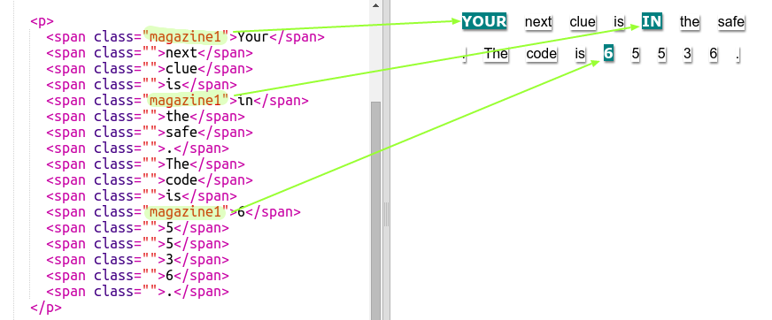

## ವರ್ಗ ಶೈಲಿಗಳನ್ನು ಬಳಸುವುದು

+ ನೀವು ` class=""` in the `` ಟ್ಯಾಗ್ ಗಳನ್ನು ಗಮನಿಸಿದ್ದೀರಾ? ಇದೇ ರೀತಿಯಲ್ಲಿ ಒಂದಕ್ಕಿಂತ ಹೆಚ್ಚು ವಿಷಯಗಳನ್ನು ಸ್ಟೈಲ್ ಮಾಡಲು ನೀವು ಇದನ್ನು ಬಳಸಬಹುದು.

+ ನೀವು ` magazine 1` ವರ್ಗವನ್ನು ಕೆಲವು `` ಟ್ಯಾಗ್ ಗಳಿಗೆ ಸೇರಿಸಿ ನಿಮ್ಮ ವೆಬ್‌ಪುಟವನ್ನು ಪರೀಕ್ಷಿಸಬಹುದು.

+ ನೀವು ಒಂದು ಅಂಶಕ್ಕೆ ಒಂದಕ್ಕಿಂತ ಹೆಚ್ಚು ವರ್ಗಗಳನ್ನು ಸೇರಿಸಬಹುದು. ನಡುವೆ ಜಾಗವನ್ನು ಬಿಡಿ. ನಿಮ್ಮ `big` ವರ್ಗವನ್ನು ``ಟ್ಯಾಗ್‌ಗೆ ಸೇರಿಸಿ. ನಿಮ್ಮ ವೆಬ್‌ಪುಟವನ್ನು ಪರೀಕ್ಷಿಸಿ. 

