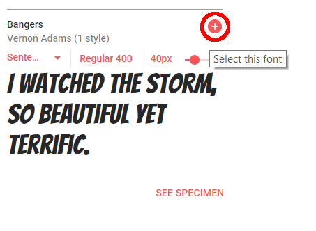

## ಹೊಸ ವರ್ಗವನ್ನು ರಚಿಸಿ

ಕಾಮಿಕ್‌ನಿಂದ ಕತ್ತರಿಸಿದಂತೆ ಕಾಣುವ ಶೈಲಿಯನ್ನು ರಚಿಸೋಣ. <a href="http://jumpto.cc/web-fonts" target="_blank">jumpto.cc/web-fonts</a> ರಾಶಿಗಟ್ಟಲೆ ಫಾಂಟ್‌ಗಳನ್ನು ಬಳಸಲು ಉಚಿತವಾಗಿ ಒದಗಿಸುತ್ತದೆ.

+ `comic` ವರ್ಗವನ್ನು **style.css** ಫೈಲ್ ಗೆ ಸೇರಿಸಿ. `magazine 2` ಆದಮೇಲೆ ಉತ್ತಮ ಸ್ಥಳವಾಗಿದೆ. ವರ್ಗದ ಹೆಸರಿನ ಮುಂದಿನ ಚುಕ್ಕೆಯನ್ನು ಮರೆಯಬೇಡಿ. 

'The Rule is empty (ನಿಯಮ ಖಾಲಿಯಾಗಿದೆ)' ಎಂದು ನಿಮಗೆ ಎಚ್ಚರಿಕೆ ಬಂದರೆ ಚಿಂತಿಸಬೇಡಿ; ನೀವು ಅದನ್ನು ಮುಂದೆ ಸರಿಪಡಿಸಬಹುದು.

+ ಈಗ ಕಾಮಿಕ್ CSS ವರ್ಗಕ್ಕೆ ಕೆಲವು CSS ಸೇರಿಸಿ. ನೀವು ಬಯಸಿದರೆ ವಿವಿಧ ಬಣ್ಣಗಳನ್ನು ಬಳಸಬಹುದು. <a href="http://jumpto.cc/colours" target="_blank">jumpto.cc/colours</a> ನಲ್ಲಿ ಹೆಚ್ಚಿನ CSS ಬಣ್ಣದ ಹೆಸರುಗಳನ್ನು ನೀವು ಕಾಣಬಹುದು.

+ ನಿಮ್ಮ HTML ಡಾಕ್ಯುಮೆಂಟ್‌ನಲ್ಲಿನ ಕೆಲವು `` ಟ್ಯಾಗ್‌ಗಳಲ್ಲಿ ಕಾಮಿಕ್ ಶೈಲಿಯನ್ನು ಬಳಸಿ ಮತ್ತು ನಿಮ್ಮ ಪುಟವನ್ನು ಪರೀಕ್ಷಿಸಿ:

+ ಈಗ ನೀವು ಮೋಜಿನ ಫಾಂಟ್ ಅನ್ನು ಸೇರಿಸಬಹುದು. ಹೊಸ ಬ್ರೌಸರ್ ಟ್ಯಾಬ್ ಅಥವಾ ವಿಂಡೋ ತೆರೆಯಿರಿ. <a href="http://jumpto.cc/web-fonts" target="_blank">jumpto.cc/web-fonts</a> ಗೆ ಹೋಗಿ ಮತ್ತು **'bangers'**ಗಾಗಿ ಹುಡುಕಿ:

+ Click on the font preview box then click on '+ Select this style':

View your selected fonts by clicking on the 'View your selected families' icon in the top right menu bar:

+ Go to the 'Use on the web' section, copy the text from the <link />
    box:

+ ನೀವು Google ಫಾಂಟ್‌ಗಳಿಂದ ನಕಲಿಸಿದ `<link>` ಕೋಡ್ ಅನ್ನು ನಿಮ್ಮ ವೆಬ್‌ಪುಟದ `<head>` ಗೆ ಅಂಟಿಸಿ:

ನಿಮ್ಮ ವೆಬ್‌ಪುಟದಲ್ಲಿ Bangers ಫಾಂಟ್ ಅನ್ನು ಬಳಸಲು ಇದು ನಿಮ್ಮನ್ನು ಅನುಮತಿಸುತ್ತದೆ.

+ Return to Google fonts and scroll further down to copy the CSS font-family code:

+ ಈಗ ನೀವು ನಿಮ್ಮ trinket ಫೈಲ್ ನ **'style.css'** ಗೆ ಹಿಂತಿರುಗಿ ಮತ್ತು ಫಾಂಟ್-ಫ್ಯಾಮಿಲಿ ಕೋಡ್ ಅನ್ನು ಕಾಮಿಕ್ ಶೈಲಿಯಲ್ಲಿ ಅಂಟಿಸಿ:

+ ನಿಮ್ಮ ವೆಬ್‌ಪುಟವನ್ನು ಪರೀಕ್ಷಿಸಿ. ಅದು ಈ ರೀತಿ ಕಾಣಬೇಕು: 

