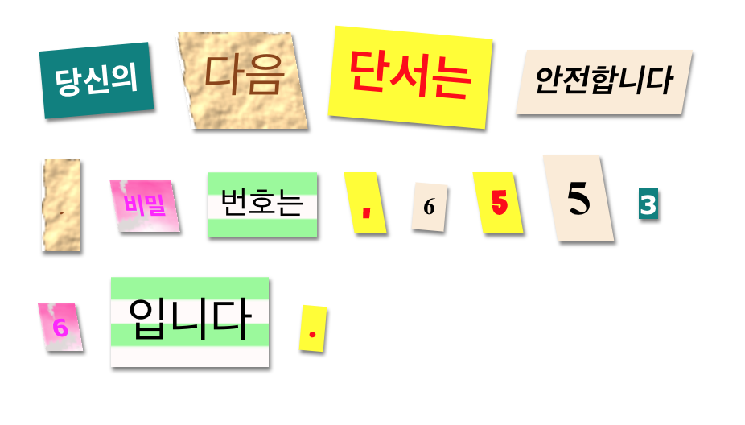

## 소개

이 프로젝트에서는 신문, 잡지, 만화 등에 있는 글자를 잘라 붙여서 수수께끼 편지를 만들어 보도록 하겠습니다.

### 교육자들을 위한 추가 정보

이 프로젝트를 인쇄하려면 [프린트용 문서](https://projects.raspberrypi.org/en/projects/mystery-letter/print)를 사용하십시오.

## \--- collapse \---

## 제목: 교육자 노트

## 소개

이 프로젝트에서 학생들은 CSS 클래스를 쓰는 방법에 대해 배웁니다. 여러 CSS 클래스로 텍스트를 스타일링하고 배경 이미지와 무료 구글 폰트를 프로젝트에 사용하는 방법도 배웁니다.

## 온라인 자료

이 자료에서는 [Trinket](https://trinket.io/)을 사용하여 HTML & CSS를 온라인으로 편집할 것을 권장합니다. 이 프로젝트에 포함된 Trinket은 다음과 같습니다:

* ['수수께끼 편지' 프로젝트 시작 -- jumpto.cc/web-letter](http://jumpto.cc/web-letter)

학생들은 새로운 Trinket[(jumpto.cc/html-black)](http://jumpto.cc/html-blank)을 사용할 수 있으며, 이를 통해 자신만의 HTML & CSS 코드를 작성하는 법을 배울 수 있습니다. 또한, 템플릿이 제공되어 있는 Trinket을 사용할 수 있습니다. [(jumpto.cc/html-template)](http://jumpto.cc/html-template).

프로젝트의 정답 샘플이 다음 Trinket에 있습니다.

* [완성된 '수수께끼 편지' 프로젝트 -- trinket.io/html/1d4d4c5ce1](https://trinket.io/html/1d4d4c5ce1)

## 오프라인 자료들

여러분의 선호에 따라 프로젝트를 [오프라인에서 완성](https://www.codeclubprojects.org/en-GB/resources/webdev-working-offline/)할 수 있습니다. 'Project Materials' 라는 링크를 클릭하여 이 프로젝트의 자료를 확인해볼 수 있습니다. 이 링크에는 학생들이 프로젝트를 오프라인으로 완료하는 데 필요한 자료가 포함된 'Project Resource' 섹션이 있습니다. 학생들이 이러한 자료의 사본에 접근할 수 있는지 확인하십시오. 이 구역에는 아래와 같은 파일들이 포함되어 있습니다.

* mystery-letter/index.html
* mystery-letter/style.css
* mystery-letter/script.js
* mystery-letter/prefixfree.js
* mystery-letter/4 x .png images
* template/template.html
* template/style.css

이 프로젝트의 완성된 버전은 'Volunteer Resources' 구역에서 찾을 수 있습니다. 여기엔 다음과 같은 파일이 있습니다:

* mystery-letter-finished/index.html
* mystery-letter-finished/style.css
* mystery-letter-finished/script.js
* mystery-letter-finished/prefixfree.js
* mystery-letter-finished/4 x .png images

(또한 위의 모든 자료는 프로젝트 및 자원봉사를 위해 `.zip` 파일로 다운로드 할 수 있습니다.)

## 학습 목표

* 이 프로젝트에서는 CSS 클래스의 사용법과 HTML에서 여러 클래스로 스타일링할 수 있는 방법에 대해 소개합니다.
* 배경 이미지와 구글 폰트 또한 프로젝트에서 소개됩니다. 

이 프로젝트는 [라즈베리파이 디지털 메이킹 커리큘럼](http://rpf.io/curriculum) 중 아래의 과정에 있는 요소들을 다룹니다.

* [2D와 3D 디자인](https://www.raspberrypi.org/curriculum/design/creator)

## 도전 과제

* "메시지 스타일링하기" - CSS Class Style에서 메시지를 스타일링 합니다.
* "컴퓨터 출력 스타일로 만들기" - CSS에서 배경 이미지와 구글 폰트를 사용해 예제 클래스를 새로 만듭니다. 
* "자신만의 스타일 만들기" - CSS로 새로운 스타일을 제작합니다.

\--- /collapse \---

## \--- collapse \---

## title: 프로젝트 자료들

## 프로젝트 자료들

* [프로젝트의 모든 자료가 들어있는 .zip 파일](resources/letter-project-resources.zip)
* [수수께끼 편지 프로젝트 자료가 포함된 온라인 Trinket](http://jumpto.cc/web-letter)
* [온라인 Trinket 템플릿](http://jumpto.cc/trinket-template)
* [빈 Trinket](http://jumpto.cc/trinket-blank)
* [template/index.html](resources/template-index.html)
* [template/style.css](resources/template-style.css)
* [mystery-letter/index.html](resources/mystery-letter-index.html)
* [mystery-letter/style.css](resources/mystery-letter-style.css)
* [mystery-letter/prefixfree.js](resources/mystery-letter-prefixfree.js)
* [mystery-letter/rough-paper.png](resources/mystery-letter-rough-paper.png)
* [mystery-letter/canvas.png](resources/mystery-letter-canvas.png)
* [mystery-letter/pink-pattern.png](resources/mystery-letter-pink-pattern.png)
* [mystery-letter/computer-printout-paper.png](resources/mystery-letter-computer-printout-paper.png)

## 교육자를 위한 자료

* [완성된 모든 프로젝트 자료가 들어있는 .zip 파일](resources/letter-volunteer-resources.zip)
* [완성된 온라인 Trinket 프로젝트](https://trinket.io/html/1d4d4c5ce1)
* [mystery-letter-finished/index.html](resources/mystery-letter-finished-index.html)
* [mystery-letter-finished/style.css](resources/mystery-letter-finished-style.css)
* [mystery-letter-finished/prefixfree.js](resources/mystery-letter-finished-prefixfree.js)
* [mystery-letter-finished/rough-paper.png](resources/mystery-letter-finished-rough-paper.png)
* [mystery-letter-finished/canvas.png](resources/mystery-letter-finished-canvas.png)
* [mystery-letter-finished/pink-pattern.png](resources/mystery-letter-finished-pink-pattern.png)
* [mystery-letter-finished/computer-printout-paper.png](resources/mystery-letter-finished-computer-printout-paper.png)

\--- /collapse \---