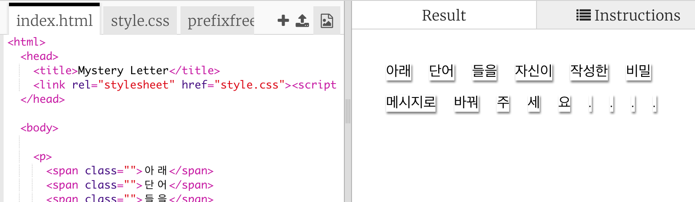

## 메시지 편집하기

전 단계에서 고른 메시지를 웹 페이지에 넣어 봅시다.

+ 다음 Trinket 파일을 열어주세요. <a href="http://jumpto.cc/web-letter" target="_blank">jumpto.cc/web-letter</a>.
    
    Trinket을 열면 아래와 같은 프로젝트가 보일 것입니다.
    
    

+ `
` 태그는 '생일 축하해요' 프로젝트에서 소개가 된 태그입니다. `` 태그는 문장을 꾸밀 수 있도록 단락보단 더 작은 단위로 묶어주는 태그입니다. 

+ `` 안에 있는 예제 단어를 제거하고, 자신의 수수께끼 메시지로 바꾸시기 바랍니다. 만약 자신의 수수께끼 메시지가 예제에 나와 있는 수수께끼 메시지와 길이가 다르다면 `` 태그를 지우거나 추가하여 Code를 수정해야 할 것입니다. 

+ Run을 눌러 자신이 만든 Trinket을 테스트해보세요.
    
    단어가 페이지에 붙어있는 것 처럼 스타일링된 것을 볼 수 있습니다.