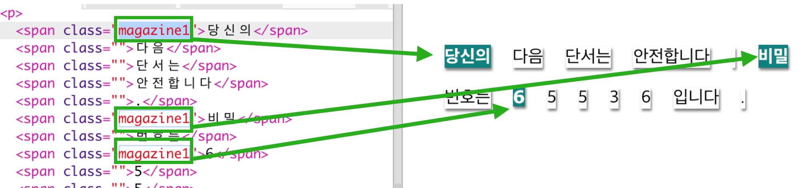
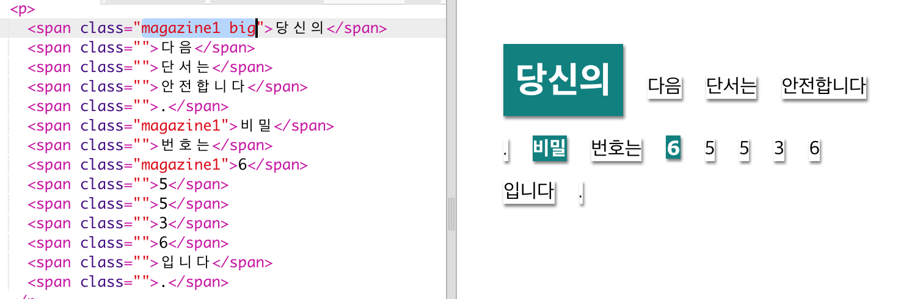

## 클래스(class) 스타일 사용하기

+ `` 태그 안에 `class=""` 속성이 있다는 것을 눈치채셨나요? 이 기능을 사용하여 클래스에 따라 스타일을 다르게 입힐 수 있습니다.

+ `magazine1` 클래스를 몇 개의 `` 태그에 추가하여 웹 페이지를 테스트해 보시기 바랍니다.

+ 하나의 객체에 2개 이상의 클래스도 추가할 수 있습니다. 클래스 사이에 공간(space)을 하나 주기만 하면 됩니다. `big` 클래스를 `` 태그 중 하나에 추가하여 페이지를 테스트해 보세요. 

