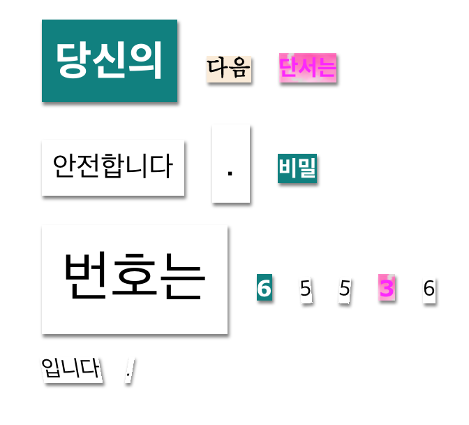

\--- challenge \---

## 과제: 메시지 스타일링하기

제공되는 스타일로 자신의 메시지를 수수께끼 메시지로 꾸며 보세요.

아래 클래스를 `` 태그에 추가합니다.

+ `newspaper`, `magazine1`, `magazine2`

+ `medium`, `big`, `reallybig`

+ `rotateleft`, `rotateright`

+ `skewleft`, `skewright`

스타일은 하나만 지정할 수 있으므로 1개 이상의 스타일을 `` 태그에 추가하지 마세요.

아래와 같이 디자인할 수 있습니다:

\--- /challenge \---