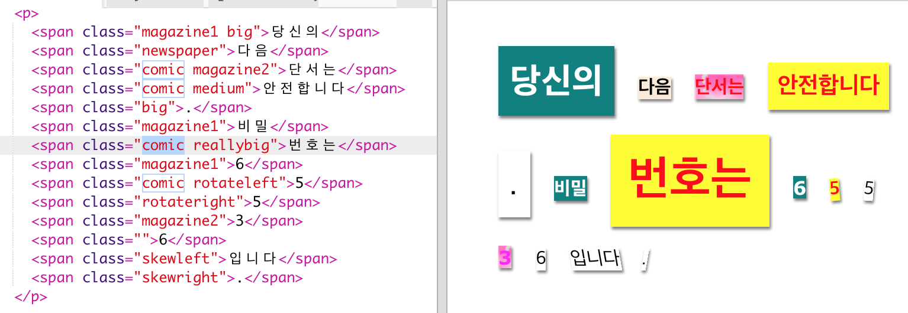
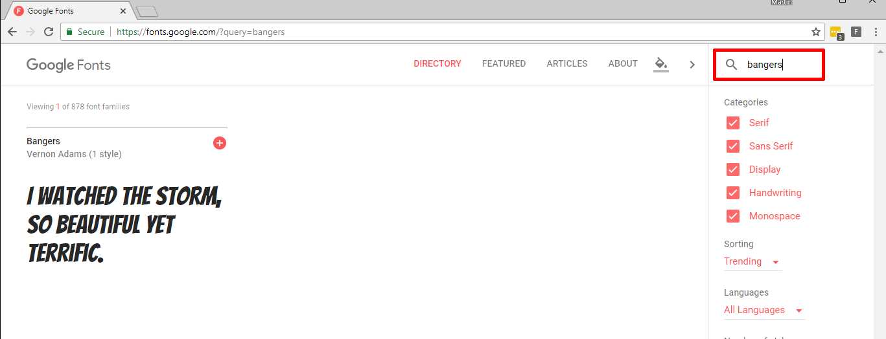
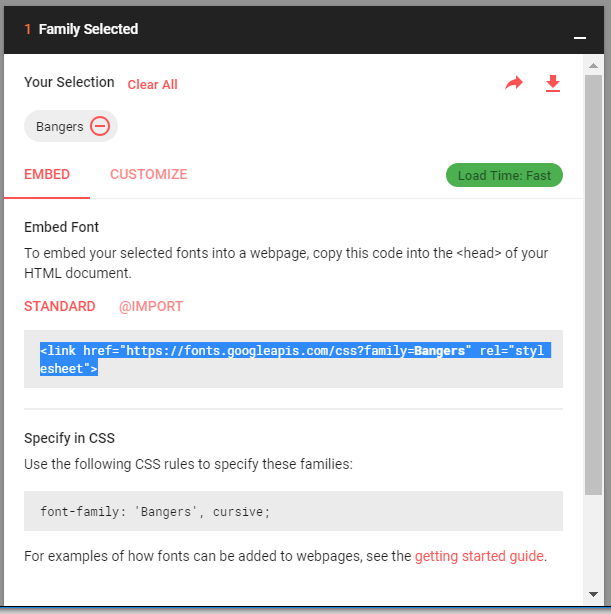
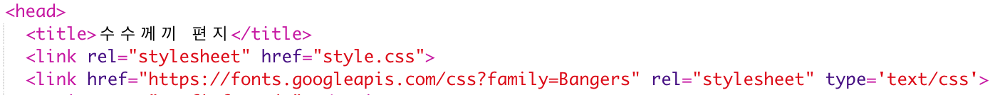
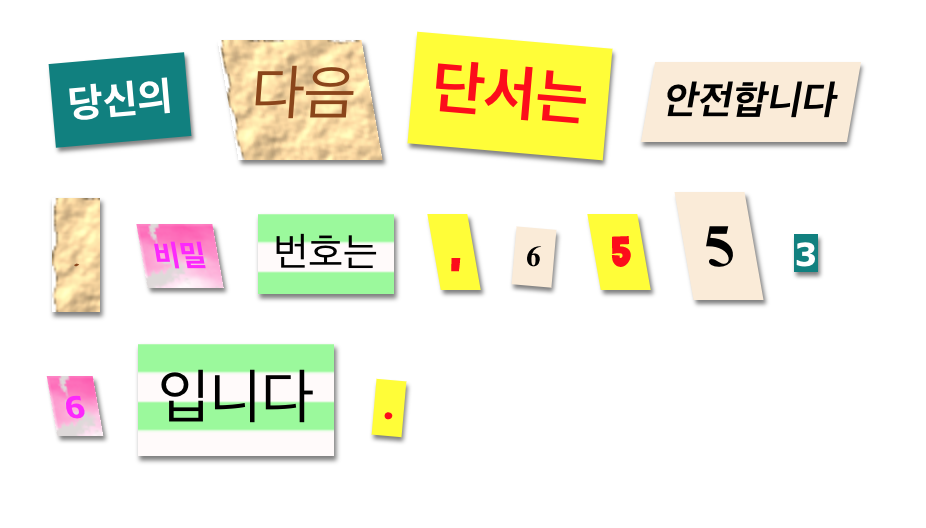

## 새 클래스 만들기

만화에서 잘라온 것 같은 글자 스타일을 만들어 봅시다. <a href="http://jumpto.cc/web-fonts" target="_blank">jumpto.cc/web-fonts</a>에서는 무료로 사용할 수 있는 웹 폰트를 제공합니다.

+ `comic` 클래스를 **style.css** 파일에 추가합니다. `magazine2` 다음에 넣는 것이 좋습니다. 클래스 이름 앞에 찍어야 하는 '.'을 잊지 마세요! 

만약 'The Rule is empty'라는 오류가 뜬다고 해도 걱정하지 마십시오; 다음에서 해결할 것입니다.

+ 약간의 CSS 코드를 comic CSS 클래스에 추가해 보도록 하겠습니다. 만약 다른 색상을 쓰고 싶다면 그래도 좋습니다. <a href="http://jumpto.cc/colours" target="_blank">jumpto.cc/colours</a>에서는 다양한 색상을 보유하고 있습니다.

+ comic 스타일을 `` 태그에 아래와 같이 적용하여 페이지에 테스트해 보십시오.

+ 이제 재미있는 폰트를 추가해 봅시다. 새로운 브라우저 탭이나 창을 켜 주세요. <a href="http://jumpto.cc/web-fonts" target="_blank">jumpto.cc/web-fonts</a>에서 **'Bangers'** 폰트를 검색해 보십시오. (이 폰트는 한국어가 지원되지 않아, 아래 예제에서는 임시로 수수께끼 편지 내용에 영어를 사용했음을 알려드립니다. 한국어가 지원되는 폰트는 링크에 들어가 보시면 많으니 다른 폰트도 적용해 보시기 바랍니다.)

+ Click on the font preview box then click on '+ Select this style':

View your selected fonts by clicking on the 'View your selected families' icon in the top right menu bar:

+ Go to the 'Use on the web' section, copy the text from the <link />
    box:

+ `<link>` 코드를 `<head>`부분에 아래와 같이 붙여 넣으세요.

이를 통해 Bangers 폰트를 웹 페이지에서 사용할 수 있습니다.

+ Return to Google fonts and scroll further down to copy the CSS font-family code:

+ 그 다음, **'style.css'** 파일의 comic 스타일에 아래와 같이 font-family 코드를 추가합니다.

+ 웹 페이지를 테스트해 보세요. 아래와 같은 결과가 나올 것입니다. 

