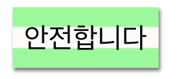

\--- challenge \---

## 과제: 컴퓨터 출력 스타일 만들기

옛날의 컴퓨터 출력 스타일을 몇 단어에 적용해 봅시다:

구현하기 위해 필요한 내용:

+ `VT323` 폰트를 <a href="http://jumpto.cc/web-fonts" target="_blank">jumpto.cc/web-fonts</a>에서 구할 수 있습니다. Google Fonts를 사용하는 방법은 Step 5에 언급되어 있으니 참고하시기 바랍니다.

+ 배경 이미지로는 `computer-printout-paper.png`를 사용합니다. Step 4에 배경 이미지를 사용하는 방법이 언급되어 있으니 참고하시기 바랍니다.

\--- /challenge \---