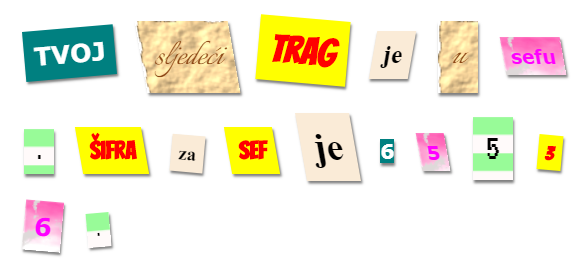

## Uvod

U ovom projektu napravićeš zagonetno pismo koje izgleda kao da je svaka riječ izrezana iz različitih novina, časopisa, stripova ili nekog drugog izvora.

\--- print-only \---

\--- /print-only \---

\--- no-print \--- <iframe src="https://editor.raspberrypi.org/en/embed/viewer/mystery-letter-complete" width="100%" height="900" frameborder="0" marginwidth="0" marginheight="0" allowfullscreen> </iframe> 

\--- /no-print \---