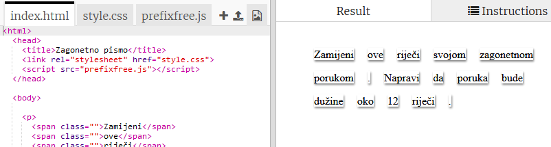
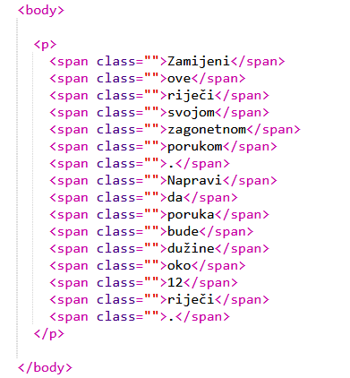
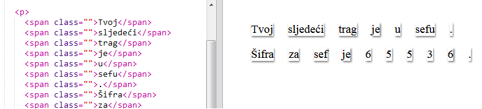

## Uređivanje poruke

Postavimo tvoju poruku na veb-stranicu.

+ Otvori sljedeći trinket: <a href="http://trinket.io/html/5700b97d81" target="_blank">trinket.io/html/5700b97d81</a>.
    
    Projekat treba da izgleda ovako:
    
    

+ Sa oznakom za pasus `
` upoznali smo se u projektu 'Srećan rođendan'. Oznaka `` koristi se za grupisanje manjih dijelova teksta unutar pasusa, kako bismo ih mogli stilizovati.

+ Zamijeni riječi svojom porukom, stavljajući po jednu riječ unutar svake oznake ``. Ako se dužina tvoje poruke razlikuje od predložene, biće potrebno da dodaš ili ukloniš oznake ``. 

+ Klikni na dugme Run da isprobaš svoj trinket.
    
    Ako pogledaš riječi, uočićeš da su stilizovane tako da izgledaju kao da su zalijepljene na stranicu.