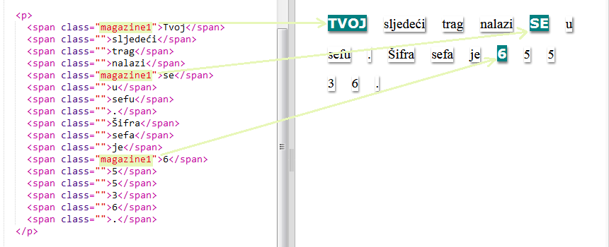
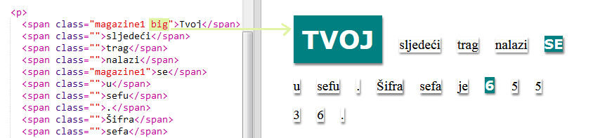

## Upotreba stilova klase

+ Da li primjećuješ tekst `class=''''` (klasa) koji se nalazi unutar oznake ``? Možeš ga koristiti za stilizovanje više elemenata na isti način.

+ Dodaj klasu `magazine1` u nekoliko `` oznaka i provjeri svoju veb-stranicu.

+ Jednom elementu možeš da dodaš više klasa. Potrebno je samo da između njih ostaviš razmak. Dodaj klasu `big` u jednu od svojih `` oznaka. Provjeri svoju stranicu. 

