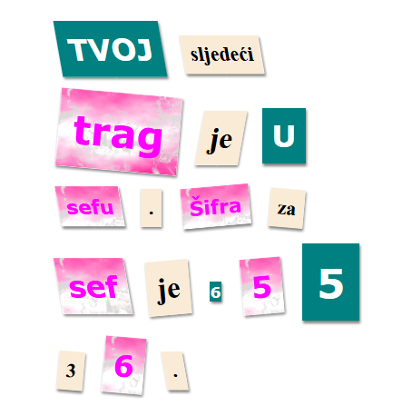

--- challenge ---

## Izazov: Stilizuj svoju poruku

Upotrijebi stilove date u nastavku teksta i napravi da tvoja poruka izgleda kao zagonetno pismo.

Dodaj sljedeće klase svojim `` oznakama:

+ `newspaper` (novine), `magazine1` (časopis1), `magazine2` (časopis2)

+ `medium`, (srednji) `big` (veliki), `reallybig` (veoma veliki)

+ `rotateleft` (rotiraj ulijevo), `rotateright` (rotiraj udesno)

+ `skewleft` (iskosi ulijevo), `skewright` (iskosi udesno)

Nemoj dodavati više od jedne klase iz istog reda pojedinoj `` oznaci.

Tvoje pismo bi moglo da izgleda ovako:

--- /challenge ---