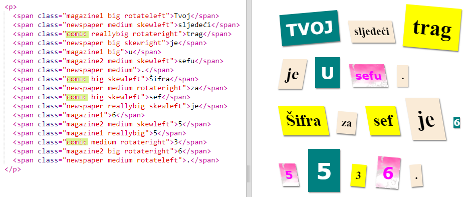
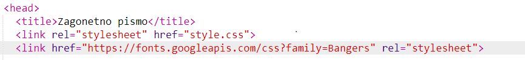
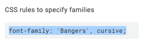
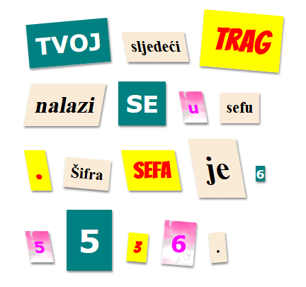

## Izradi novu klasu

Izradimo stil koji izgleda kao da je izrezan iz stripa (comic). Na <a href="http://jumpto.cc/web-fonts" target="_blank">jumpto.cc/web-fonts</a> možeš pronaći veliki broj fontova besplatnih za upotrebu.

+ Dodaj klasu `comic` u datoteku **style.css**. Poslije klase `magazine2` je dobro mjesto. Ne zaboravi tačku ispred naziva klase. 

Ne brini ako dobiješ poruku 'The rule is empty' (Pravilo je prazno); to ćemo uskoro popraviti.

+ Sada dodaj malo CSS-a u CSS klasu comic. Ako želiš, možeš da koristiš različite boje. Na <a href="http://jumpto.cc/colours" target="_blank">jumpto.cc/colours</a> možeš pronaći spisak velikog broja boja.

+ Upotrijebi stil comic u nekoj od `` oznaka u svom HTML dokumentu i provjeri svoju stranicu:

+ Sada možeš da dodaš neki zabavan font. Otvori novu karticu ili prozor pregledača. Idi na <a href="http://jumpto.cc/web-fonts" target="_blank"> jumpto.cc/web-fonts</a> i potraži **bangers**:

+ Klikni na dugme 'Select this font' (Odaberi ovaj font): 

Na dnu ekrana pojaviće se poruka "1 Family Selected".

+ Klikni na poruku "1 Family Selected" da otvoriš prozor i kopiraš označeni kôd:

+ Unesi `<link>` kôd kopiran iz 'Google fonts’' u `<head>` svoje veb-stranice:

To će ti omogućiti da koristiš font Bangers na svojoj veb-stranici.

+ Vrati se na 'Google fonts', listaj nadolje i kopiraj sljedeći 'font-family' kôd:

+ Sada se vrati na **'style.css'** i prenesi kopirani 'font-family' kôd u stil comic:

+ Provjeri veb-stranicu. Rezultat bi trebalo bi da izgleda slično ovome: 

