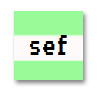

\--- challenge \---

## Izazov: Napravi stil za štampu na računaru

Kreiraj staromodni stil za štampu na računaru i primijeni ga na neke riječi:

Trebaće ti:

+ `VT323` font sa <a href="http://jumpto.cc/web-fonts" target="_blank">jumpto.cc/web-fonts</a>. Ako ti je potrebno da se podsjetiš kako se koristi Google fonts, vrati se na Korak 5.

+ Pozadinska slika `computer-printout-paper.png`. Look back at Step 4 if you need a reminder on using background images.

\--- /challenge \---