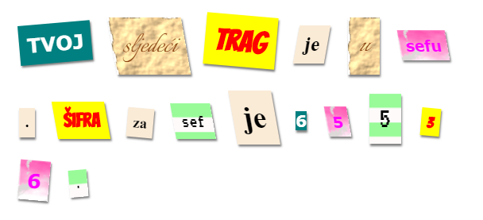

--- challenge ---

## Izazov: Kreiraj sopstvene stilove

Sada kreiraj sopstvene stilove klase i svoje zagonetno pismo učini još zanimljivijim. Koristi naučeno o CSS-u u prethodnim projektima, a za ideje pogledaj primjere u **style.css** datoteci.

Ovdje je primjer:

Slike koje su dostupne za upotrebu možeš da pregledaš kada klikneš na karticu za slike u trinketu. Pokušaj da postaviš pozadinske slike koristeći jednu od datih slika:

+ `rough-paper.png`

+ `canvas.png`

Ako imaš trinket nalog, možeš učitati i sopstvene slike, kao što smo uradili u projektu 'Ispričaj priču'.

Na <a href="http://jumpto.cc/web-fonts" target="_blank">jumpto.cc/web-fonts</a> nađi fontove koji ti se sviđaju i kopiraj njihov `<link>` i CSS kôd u svoj trinket kako bi ih mogao/mogla koristiti.

--- /challenge ---