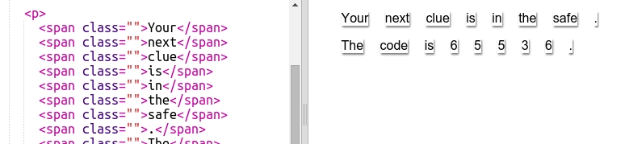

## तुमचा संदेश बदला

तुमचा संदेश वेबपेज वर आणूया.

+ हा trinket उघडा: <a href="http://jumpto.cc/web-letter" target="_blank">jumpto.cc/web-letter</a>.
    
    प्रोजेक्ट असा दिसायला हवा:
    
    

+ हा `
` परिच्छेद टॅग 'हैप्पी बर्थडे' प्रोजेक्ट मध्ये सादर केला गेला होता. ह्या `` टॅगचा वापर परिच्छेदाच्या आत मजकूराच्या लहान तुकड्यांना गटबद्ध करण्यासाठी केला जातो जेणेकरून आम्ही त्यास स्टाईल करू शकू.

+ प्रत्येक `` मध्ये एक शब्द टाकून तुमच्या संदेशासाठी शब्द बदला. तुमचा संदेश भिन्न लांबीचा असल्यास तुम्हाला `` टॅग जोडण्याची किंवा काढण्याची गरज पडेल. 

+ तुमच्या trinket ची तपासणी घेण्यासाठी Run बटण वर क्लिक करा.
    
    जर तुम्ही शब्दांकडे पाहिले तर तुम्हाला ते पृष्ठावर अडकल्यासारखे दिसेल.