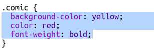

## नवीन वर्ग तयार करा

चला एक स्टाईल बनवू जी दिसते की ती कॉमिकमधून कापली गेली आहे. <a href="http://jumpto.cc/web-fonts" target="_blank">jumpto.cc/web-fonts</a> खूप सगळे फॉन्ट्स मोफत वापरायला देते.

+ `comic` शैली ला **style.css** फाइल मधे जोडा. `magazine2` च्या नंतर चांगली जागा आहे. वर्गाच्या नावासमोर ठिपके विसरू नका. 

तुम्हाला 'The Rule is empty'' असे सांगणारी चेतावणी मिळाल्यास काळजी करू नका; आपण ती पुढे ठीक करू.

+ आता कॉमिक सीएसएस (CSS) वर्ग मध्ये थोडा अजून सीएसएस (CSS) जोडा. तुम्हाला आवडत असल्यास भिन्न रंग वापरू शकता. <a href="http://jumpto.cc/colours" target="_blank">jumpto.cc/colours</a> वर अधिक रंगांची नावे मिळू शकतात.

+ तुमच्या एचटीएमएल (HTML) डॉक्युमेंटमधील काही `` टॅगमध्ये कॉमिक शैली वापरा आणि आपल्या पेजची चाचणी घ्या:

+ आता तुम्ही एक मजेदार फॉन्ट जोडू शकता. नवीन ब्राउझर टॅब किंवा विंडो उघडा. <a href="http://jumpto.cc/web-fonts" target="_blank">jumpto.cc/web-fonts</a> वर जा आणि **'bangers'** शोधा:

+ + "Select this font" बटणावर क्लिक करा:

"1 Family Selected" असे एक संदेश स्क्रीनच्या तळाशी दिसेल.

+ विंडो उघडण्यासाठी आणि हायलाइट केलेला कोड कॉपी करण्यासाठी "1 Family Selected" संदेश वर क्लिक करा:

+ तुमच्या वेबपेज `<head>` मध्ये तुम्ही नुकताच Google fonts वरून कॉपी केलेला `<link>` कोड पेस्ट करा:

हे तुम्हाला तुमच्या वेबपेजमध्ये Bangers फॉन्ट वापरण्याची परवानगी देते.

+ Google fonts वर परत येऊन पेजला आणखी खाली स्क्रोल करा आणि font-family कोड कॉपी करा:

+ आता तुमच्या trinket मधल्या **'style.css'** फाइल वर परत जा आणि कॉमिक शैलीमध्ये font-family कोड पेस्ट करा:

+ तुमच्या वेबपेजची चाचणी घ्या. परिणाम यासारखे काहीतरी दिसले पाहिजे: 

