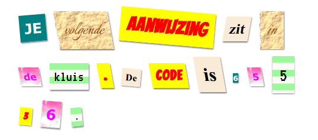

## Inleiding

In dit project maak je een mysterieuze brief die eruit ziet alsof elk woord uit een andere krant, tijdschrift, strip of andere bron is gesneden.

### Aanvullende informatie voor clubleiders

Als je dit project wilt afdrukken, gebruik dan de [Printervriendelijke versie](https://projects.raspberrypi.org/en/projects/mystery-letter/print).

## \--- collapse \---

## titel: Clubleider notities

## Inleiding:

In dit project maken kinderen kennis met CSS-klassen. Ze gebruiken meerdere CSS-klassen om tekst te stijlen en leren ook achtergrondafbeeldingen en gratis Google-lettertypen te gebruiken in hun projecten.

## Online bronnen

We raden aan [trinket](https://trinket.io/) te gebruiken om HTML & CSS online te schrijven. Dit project bevat de volgende trinket:

* [Beginpunt 'Mystery Letter' - jumpto.cc/web-letter](http://jumpto.cc/web-letter)

Kinderen kunnen ook gebruik maken van deze lege trinket [(jumpto.cc/html-blank)](http://jumpto.cc/html-blank) om hun eigen HTML & CSS te schrijven, of ze kunnen deze sjabloontrinket [(jumpto.cc/html-template)](http://jumpto.cc/html-template) gebruiken.

Er is ook een trinket met een voorbeeldoplossing voor de uitdagingen:

* ['Mystery Letter gereed' - trinket.io/html/1d4d4c5ce1](https://trinket.io/html/1d4d4c5ce1)

## Offline bronnen

Dit project kan indien gewenst [geheel offline ](https://www.codeclubprojects.org/en-GB/resources/webdev-working-offline/) voltooid worden. Je kunt toegang krijgen tot de projectbronnen door op de koppeling 'Projectmaterialen' voor dit project te klikken. Deze link bevat een gedeelte 'Projectresources', dat bronnen bevat die kinderen nodig hebben om dit project offline te voltooien. Zorg ervoor dat elk kind toegang heeft tot een kopie van deze bronnen. Dit gedeelte bevat de volgende bestanden:

* mystery-letter/index.html
* mystery-letter/style.css
* mystery-letter/script.js
* mystery-letter/prefixfree.js
* mystery-letter/4 x .png images
* template/template.html
* template/style.css

Je kunt ook een voltooide versie van de uitdagingen van dit project vinden in de sectie 'Vrijwilligersbronnen', die bevat:

* mystery-letter-finished/index.html
* mystery-letter-finished/style.css
* mystery-letter-finished/script.js
* mystery-letter-finished/prefixfree.js
* mystery-letter-finished/4 x .png images

(Alle bovenstaande bronnen kunnen ook worden gedownload als project en als vrijwilliger `.zip` bestanden.)

## leerdoelen

* Dit project introduceert CSS-klassen en de mogelijkheid HTML-elementen op te maken met meerdere klassen.
* Achtergrondafbeeldingen en Google-lettertypen worden ook geïntroduceerd. 

Dit project behandelt elementen uit de volgende onderdelen van het [Raspberry Pi Digital Making Curriculum](http://rpf.io/curriculum):

* [Ontwerp standaard 2D- en 3D-objecten](https://www.raspberrypi.org/curriculum/design/creator).

## Uitdagingen

* "Maak je bericht op" - Pas geleverde CSS class styles toe;
* "Een computer opmaakstijl maken" - Gebruik CSS om een ​​nieuwe class met een achtergrondafbeelding en een Google-lettertype te maken. 
* "Maak je eigen stijlen" - Gebruik CSS om nieuwe stijlen te maken.

\--- /collapse \---

## \--- collapse \---

## titel: Projectmaterialen

## Project middelen

* [.zip-bestand met alle projectbronnen](resources/letter-project-resources.zip)
* [Online Trinket met alle 'Mystery Letter'-projectbronnen](http://jumpto.cc/web-letter)
* [Online Trinket-sjabloon](http://jumpto.cc/trinket-template)
* [Online lege Trinket](http://jumpto.cc/trinket-blank)
* [template/index.html](resources/template-index.html)
* [template/style.css](resources/template-style.css)
* [mystery-letter/index.html](resources/mystery-letter-index.html)
* [mystery-letter/style.css](resources/mystery-letter-style.css)
* [mystery-letter/prefixfree.js](resources/mystery-letter-prefixfree.js)
* [mystery-letter/rough-paper.png](resources/mystery-letter-rough-paper.png)
* [mystery-letter/canvas.png](resources/mystery-letter-canvas.png)
* [mystery-letter/pink-pattern.png](resources/mystery-letter-pink-pattern.png)
* [mystery-letter/computer-printout-paper.png](resources/mystery-letter-computer-printout-paper.png)

## Club leider middelen

* [.zip-bestand met alle voltooide projectresources](resources/letter-volunteer-resources.zip)
* [Online voltooid Trinket-project](https://trinket.io/html/1d4d4c5ce1)
* [mystery-letter-finished/index.html](resources/mystery-letter-finished-index.html)
* [mystery-letter-finished/style.css](resources/mystery-letter-finished-style.css)
* [mystery-letter-finished/prefixfree.js](resources/mystery-letter-finished-prefixfree.js)
* [mystery-letter-finished/rough-paper.png](resources/mystery-letter-finished-rough-paper.png)
* [mystery-letter-finished/canvas.png](resources/mystery-letter-finished-canvas.png)
* [mystery-letter-finished/pink-pattern.png](resources/mystery-letter-finished-pink-pattern.png)
* [mystery-letter-finished/computer-printout-paper.png](resources/mystery-letter-finished-computer-printout-paper.png)

\--- /collapse \---