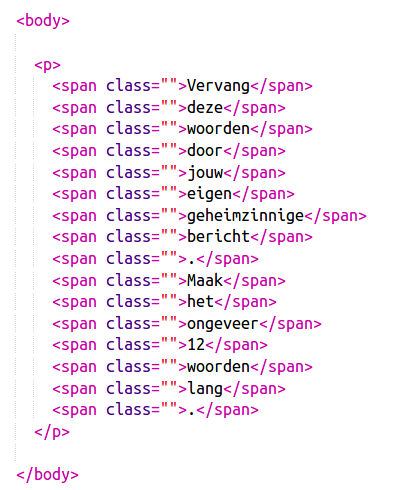

## Je bericht bewerken

Laten we je bericht op een webpagina plaatsen.

+ Open deze trinket: <a href="http://jumpto.cc/web-letter" target="_blank">jumpto.cc/web-letter</a>.
    
    Het project zou er als volgt uit moeten zien:
    
    

+ De `
` alinea-tag wordt geïntroduceerd in het project 'Happy Birthday'. De `` tag wordt gebruikt om kleinere stukjes tekst in een alinea te groeperen, zodat we ze kunnen opmaken.

+ Wijzig de woorden in je bericht door één woord in elke `` te plaatsen. Je moet `` -tags toevoegen of verwijderen als je bericht een andere lengte heeft. 

+ Klik op de knop Uitvoeren om je trinket te testen.
    
    Als je de woorden bekijkt, kun je zien dat ze zijn opgemaakt om eruit te zien alsof ze op de pagina zijn geplakt.