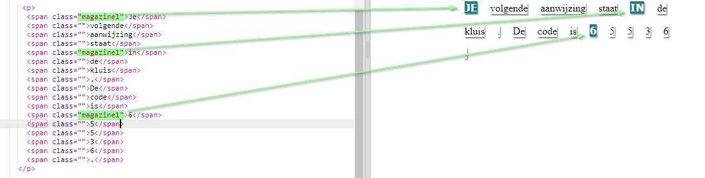
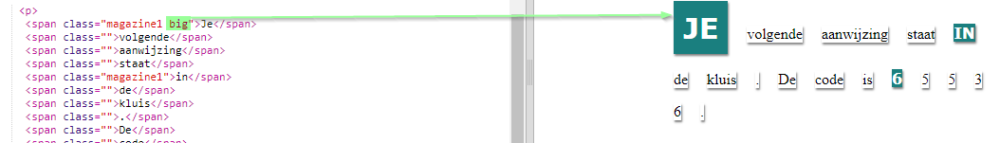

## Class Styles gebruiken

+ Heb je de `class = ""` in de `` tags opgemerkt? Je kunt dit gebruiken om meer dan één ding op dezelfde manier te stylen.

+ Voeg de `magazine1` -klasse toe aan enkele van je `` -tags en test je webpagina.

+ Je kunt meer dan één klasse aan een element toevoegen. Laat gewoon een ruimte er tussenin. Voeg de `big` class toe aan een van je `` -tags. Test je pagina. 

