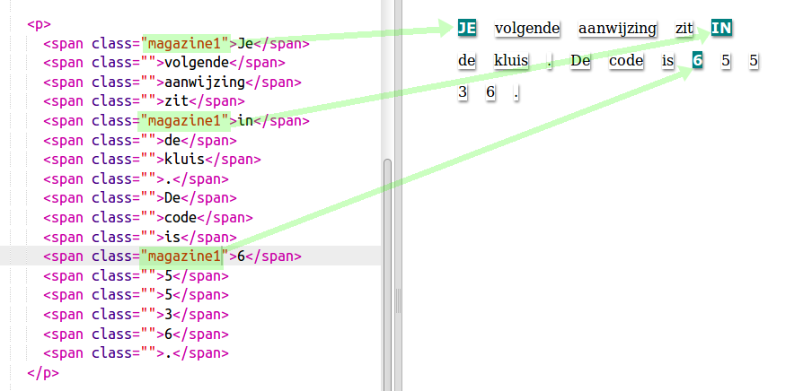

## Class stijlen gebruiken

+ Heb je de `class = ""` in de `` tags opgemerkt? Je kunt 'class' (NL: klasse) gebruiken om meer dan één ding dezelfde stijl te geven.

+ Voeg de class `magazine1` toe aan enkele van je `` -tags en test je webpagina.

+ Je kunt meer dan één class aan een element toevoegen. Laat er gewoon een ruimte tussenin. Voeg de `big` class toe aan een van je `` -tags. Test je pagina. 

