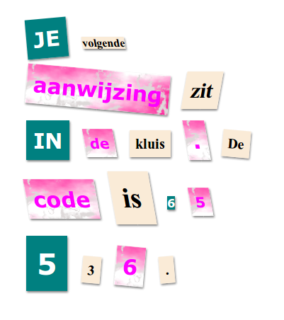

\--- challenge \---

## Uitdaging: Maak je bericht op

Gebruik de beschikbare stijlen om je bericht eruit te laten zien als een mysteriebrief.

Voeg deze classes toe aan je `` tags:

+ `krant`, `tijdschrift1`, `tijdschrift2`

+ `gemiddeld`, `groot`, `reallybig`

+ `rotateleft`, `rotateright`

+ `skewleft`, `skewright`

Voeg niet meer dan één van elke regel toe aan een bepaalde ``.

Dit is hoe uw brief eruit zou kunnen zien:

\--- /challenge \---