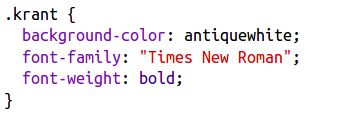
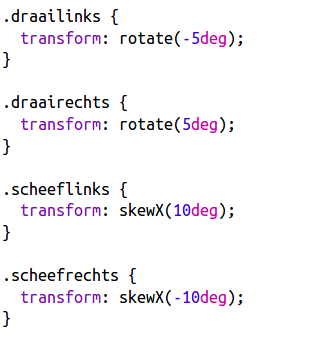

## Klasse bewerken

+ Klik op het tabblad **'style.css'**. Zoek de stijl voor de `krant` class die je hebt gebruikt.

+ Merk op dat er een punt '.' voor de naam van de klasse in het CSS-bestand staat, maar niet in de `` -tag in je HTML-document.

+ Kijk nu naar de andere CSS-klassen die je hebt gebruikt om je geheimzinnige brief vorm te geven. Kun je vinden:
    
    + Hoe de stijl `magazine1` de tekst verandert in hoofdletters.
    
    + Hoe de `magazine2` -stijl een afbeelding achter de tekst plaatst.

+ Wat gebeurt er als je de `background-image` voor `magazine2` naar `canvas.png` wijzigt? Als je liever `pink-pattern.png` hebt, kun je die weer terugzetten. 

Je kunt ook de kleuren in de magazinestijlen wijzigen als je wilt.

+ Zoek de CSS die wordt gebruikt om je woorden te draaien (rotate) en scheef te trekken (skew):

Verander de getallen eens om verschillende effecten te maken en test dan je pagina.